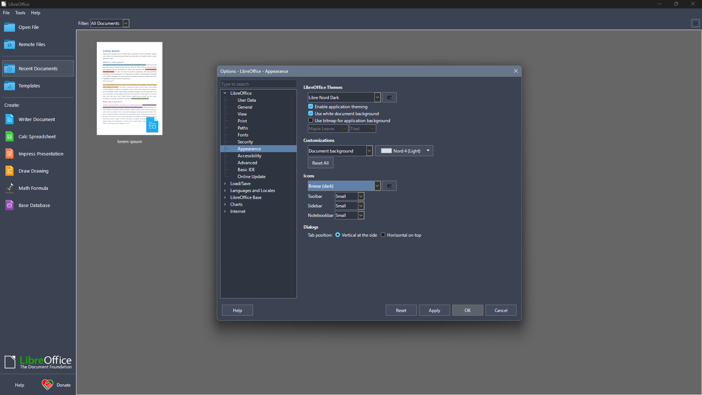
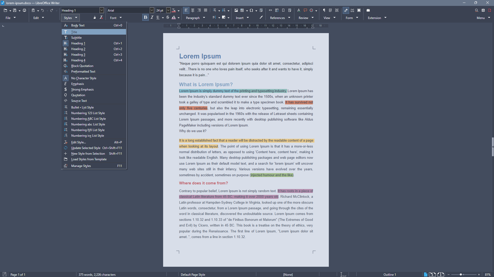
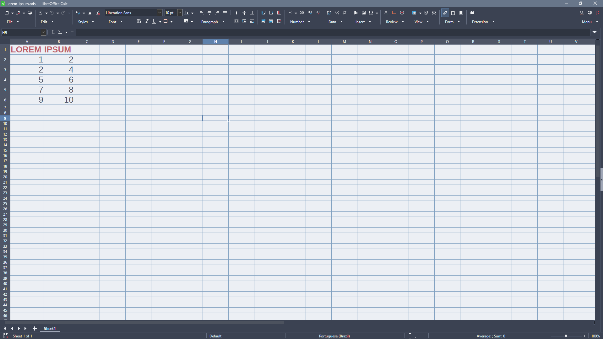
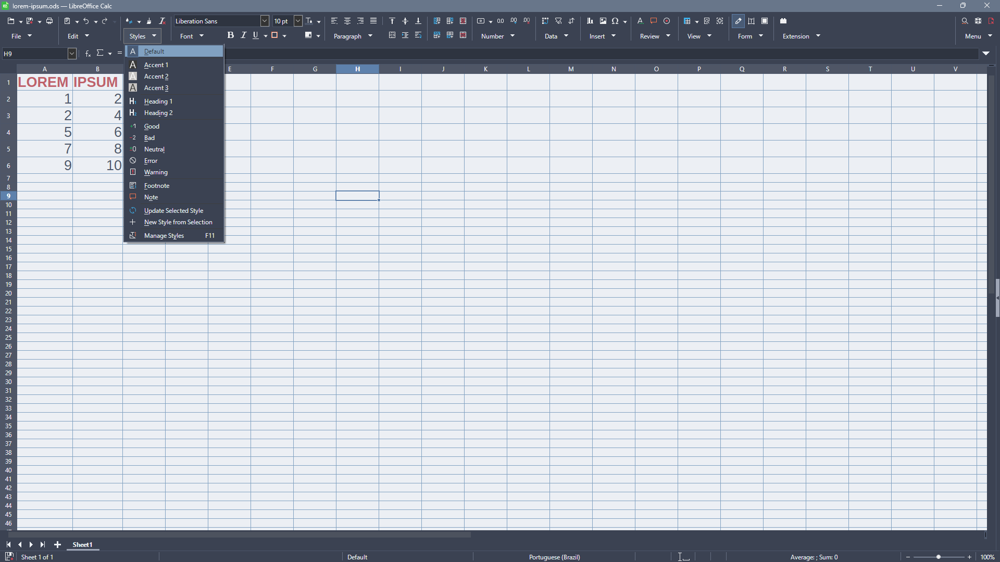
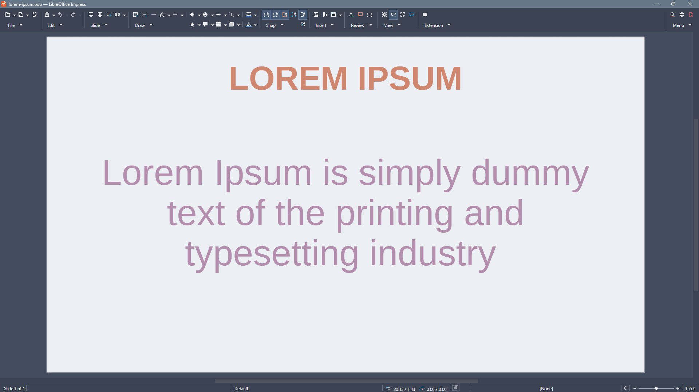
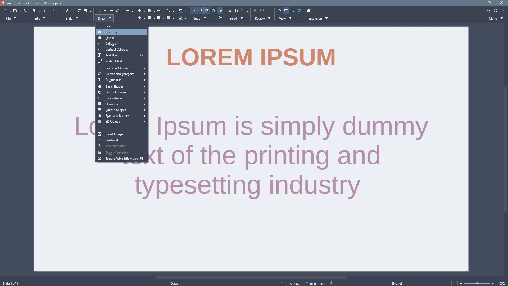
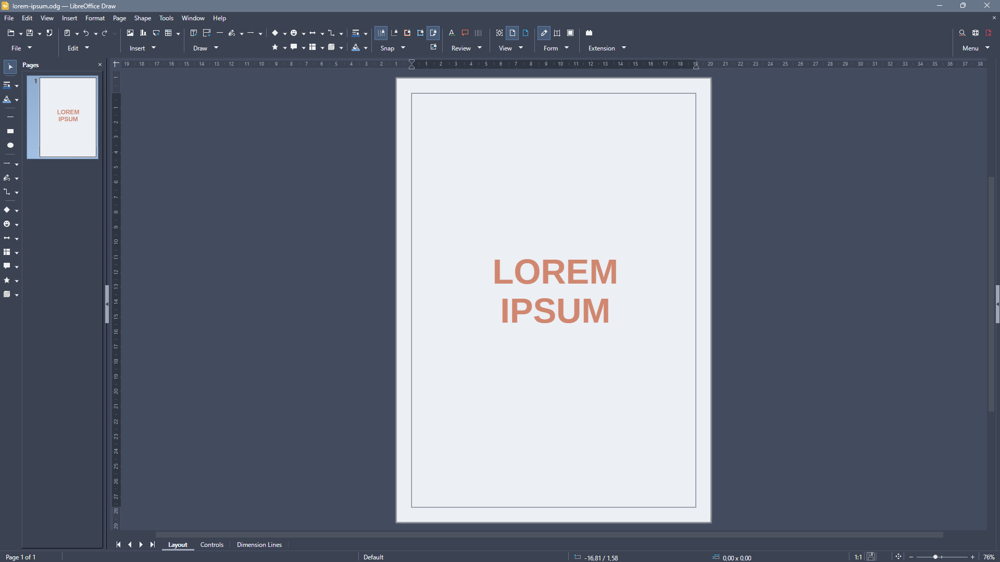
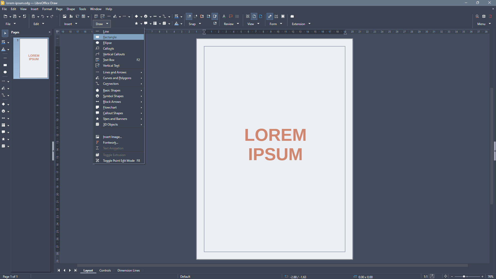
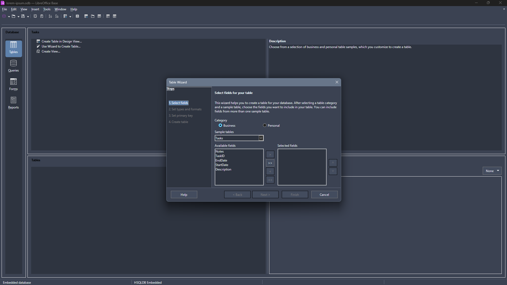
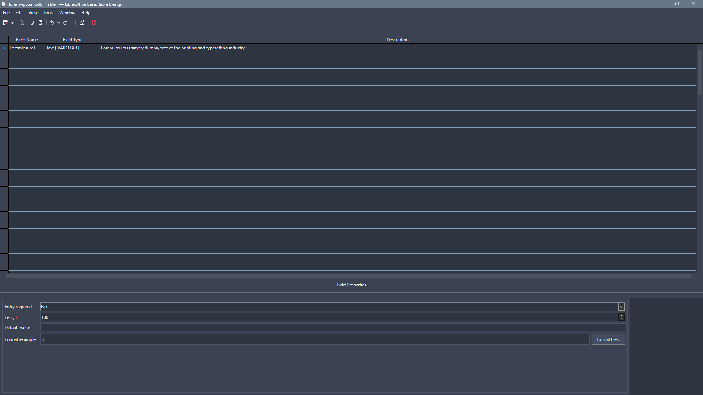

# Nord Dark Theme

[⬅ Back to main repository](../README.md)

**Nord Dark** is designed for low-light environments, offering an immersive reading and writing experience without straining the eyes. It uses deep, restful backgrounds paired with highly legible, crisp typography, and subtle highlights drawn from the vibrant Aurora palette.

## 📸 Screenshot

<table>
  <tr>
    <td colspan="2" align="center">
         
        <b>Libreoffice Image 1</b>
    </td>
  </tr>
  <tr>
    <td align="center">
       
      <b>Libreoffice Writer Image 1</b>
    </td>
    <td align="center">
       
      <b>Libreoffice Writer Image 2</b>
    </td>
  </tr>
  <tr>
    <td align="center">
       
      <b>Libreoffice Calc Image 1</b>
    </td>
    <td align="center">
       
      <b>Libreoffice Calc Image 2</b>
    </td>
  </tr>
  <tr>
    <td align="center">
       
      <b>Libreoffice Impress Image 1</b>
    </td>
    <td align="center">
       
      <b>Libreoffice Impress Image 2</b>
    </td>
  </tr>
  <tr>
    <td align="center">
       
      <b>Libreoffice Draw Image 1</b>
    </td>
    <td align="center">
       
      <b>Libreoffice Draw Image 2</b>
    </td>
  </tr>
  <tr>
    <td align="center">
       
      <b>Libreoffice Base Image 1</b>
    </td>
    <td align="center">
       
      <b>Libreoffice Base Image 2</b>
    </td>
  </tr>
</table>

## 💡 Pro Tip: Recommended Icon Set

For the absolute best results and a fully cohesive interface, we highly recommend pairing these extensions with the Breeze Dark icon set native to LibreOffice. You can easily change your icon theme by navigating to Tools > Options > Appearence > Icons and adjusting the "Icon style" dropdown.