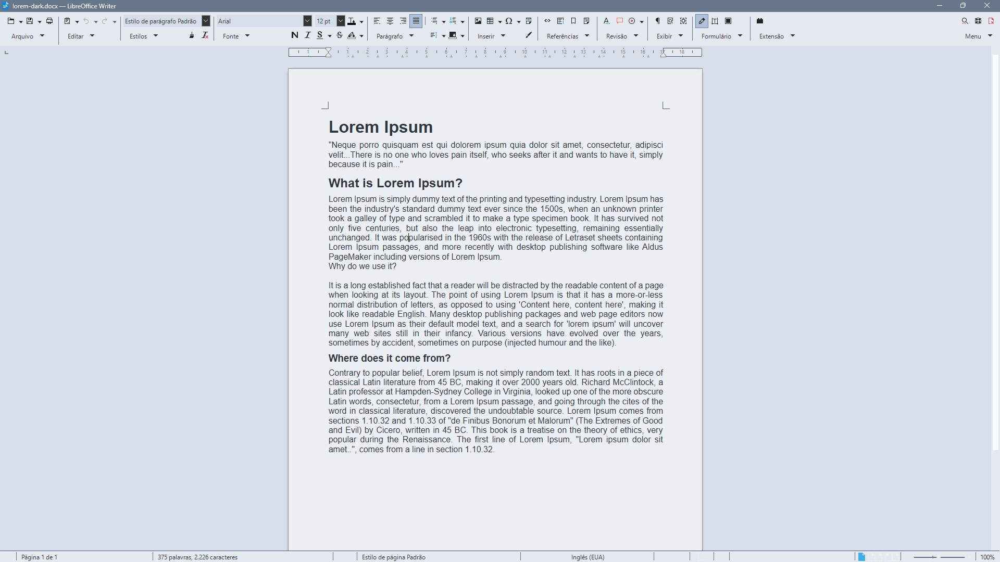

# Nord Light Theme

[⬅ Back to main repository](../../README.md)

**Nord Light** is the bright variant designed for highly illuminated workspaces. It utilizes the clean Snow Storm tones for backgrounds, ensuring maximum readability by applying the dark Polar Night tones to all text and UI elements.

## 📸 Screenshot

### Writer

###💡 Pro Tip: Recommended Icon Set

For the absolute best results and a fully cohesive interface, we highly recommend pairing these extensions with the Breeze icon set native to LibreOffice. You can easily change your icon theme by navigating to Tools > Options > Appearence > Icons and adjusting the "Icon style" dropdown.